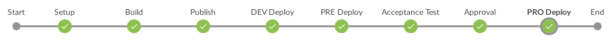
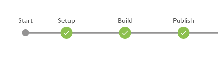
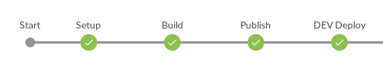
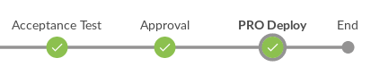
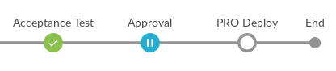
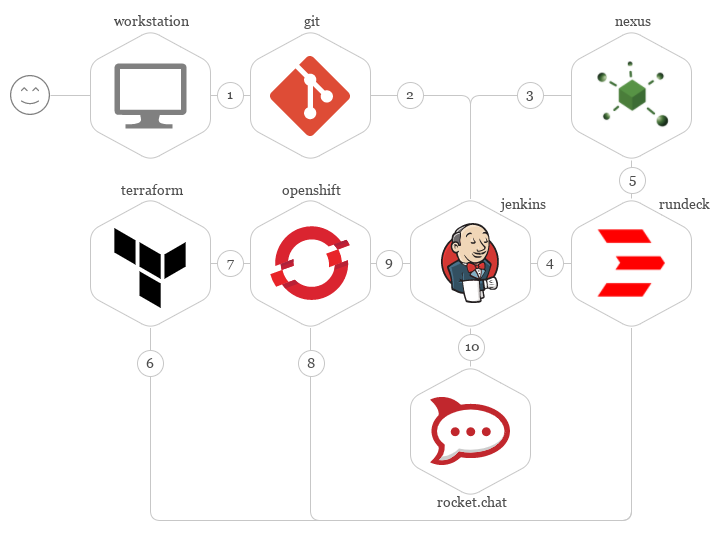

Platform as Code With Openshift
===============================

### How to set up a pipeline workflow with Openshift and the Terraform infrastructure-as-code tool to configure builds and deployments.

Red Hat Openshift is a Platform-as-a-Service --- PaaS --- that delivers things like build and deployment of Docker images over Kubernetes and many other resources. HashiCorp Terraform is a tool to implement Infrastructure-as-Code with many types of providers.

**Notes About Openshift Build and Deployment Configuration**
------------------------------------------------------------

The platform is defined by code, this code is managed by Git, built, analyzed, and versioned by the CI tool, and deployed by Terraform. If we used build or deployment offered by Openshift, the lifecycle will be managed outside of our platform-as-code pipeline, and we would not be able to reproduce the right state, or we would never know what the right configuration is. These problems are maximized if our team uses the web console.

HashiCorp Terraform is a tool to implement Infrastructure-as-Code that offers many providers for infrastructure deployment. You can look at the documentation [here](https://www.terraform.io/docs/providers/index.html).

There is no specific provider for Openshift, but there is one for [Kubernetes](https://www.terraform.io/docs/providers/kubernetes/index.html), and we will use this. In fact, Openshift exposes the entire REST API of Kubernetes.

Get the Tools
-------------

-   Openshift Client Tools v3.6.0: [download](https://github.com/openshift/origin/releases/tag/v3.6.0)

-   Terraform v0.10.7: [download](https://releases.hashicorp.com/terraform/0.10.7/)

-   Docker v17.06.0-ce

### Install Docker

To install Docker properly, follow the instructions for your operating system.

-   [Debian](https://docs.docker.com/engine/installation/linux/docker-ce/debian/)

-   [Ubuntu](https://docs.docker.com/engine/installation/linux/docker-ce/ubuntu/)

-   [CentOS](https://docs.docker.com/engine/installation/linux/docker-ce/centos/)

-   [Fedora](https://docs.docker.com/engine/installation/linux/docker-ce/fedora/)

-   [Binaries](https://docs.docker.com/engine/installation/linux/docker-ce/binaries/)

-   [Mac](https://docs.docker.com/docker-for-mac/install/)

-   [Windows](https://docs.docker.com/docker-for-windows/install/)

### Up the Openshift Cluster

For this article, we will use Openshift Origin, which can be up by following these steps.

*See more details about Origin [here](https://github.com/openshift/origin).*

Configure the insecure registry 172.30.0.0/16.

In Debian, edit `/lib/systemd/system/docker.service` and add this configuration to the end of the line which starts with `ExecStart`.

```text
 --insecure-registry 172.30.0.0/16
```

The file will look as follows:

```text
[Unit]
Description=Docker Application Container Engine
Documentation=https://docs.docker.com
After=network-online.target docker.socket firewalld.service
Wants=network-online.target
Requires=docker.socket

[Service]
Type=notify
ExecStart=/usr/bin/dockerd -H fd:// --insecure-registry 172.30.0.0/16
ExecReload=/bin/kill -s HUP $MAINPID
LimitNOFILE=1048576
LimitNPROC=infinity
LimitCORE=infinity
TimeoutStartSec=0
Delegate=yes
KillMode=process
Restart=on-failure
StartLimitBurst=3
StartLimitInterval=60s

[Install]
WantedBy=multi-user.target
```

Execute these two commands:

```shell script
systemctl daemon-reload
systemctl restart docker
```

Now you are ready to up the Openshift Origin cluster. To do this is very simple, just type `oc cluster up`.

If you got the output below everything is OK, but if you have any issues, read the official [documentation](https://github.com/openshift/origin/blob/master/docs/cluster_up_down.md).

```shell script
Starting OpenShift using openshift/origin:v3.6.0 ...
OpenShift server started.

The server is accessible via web console at:
https://127.0.0.1:8443

You are logged in as:
User: developer
Password: <any value>

To login as administrator:
oc login -u system:admin
```

The Code
--------

To illustrate a real use case I will deploy the platform for an app written in NodeJS with the following resources:

-   **namespace**: aka Project in Openshift, that will accommodate the resources below.

-   **configmap**: key/value configuration.

-   **secret**: passwords, certificates, credentials.

-   **replication controller**: control the replicas of Pods.

-   **service**: the load balancer.

-   **route**: Openshift native resource to exposes the service through an URL.

To address the route creation, we use an Openshift JSON definition and deploy it using Openshift CLI.

It's possible to classify the resources created in Openshift by the longevity of the lifecycle. I can see three: long, short, and ephemeral.

-   **long**: resources with long longevity will be replaced in some point in the future, but this will happen with low frequency because you can't move it, or once created, you will replace it after a long period of use. It's the case of **namespace**, **resource quota**, and **volume**. *Volumes can't be moved from one namespace to another.*

-   **short**: resources with a short lifecycle are replaced with some frequency because it's necessary to apply new configurations or change some parameters. It's the case of the **limit range**, **route**, and **service**.

-   **ephemeral**: its life cycle is shorter than all others and has a high replace frequency. It's the case of the **replication controller**, configmap, and **secret**.

#### Namespace

The high level of segregation of resources in the cluster, commonly known as Project on Openshift ecosystem.

#### Persistent Volume

Volumes are persistent storage to mount in containers and used to save data.

#### Route

This is the way that Openshift exposes the app to the outside world.

#### Service

Used to balance the load between Pods. Pods are instances that can accommodate one or more Docker containers. As a best practice, use just one container per Pod.

#### Secret

Used to store credentials, certificates, or sensitive data and consume them through volume mounts or environment variables.

#### Configmap

Configmap stands for Configuration Map; they can be consumed as environment variables or volume mounts.

#### Replication Controller

This is our main resource. Replication Controllers are responsible by the number of replicas and auto-scale the Pods, creating them using template.

Never, really, really never launch Pods directly.

The Pipeline
------------



To manage the environments, we use the pipeline (to get deep, read this awesome [article](https://medium.com/@kief/https-medium-com-kief-using-pipelines-to-manage-environments-with-infrastructure-as-code-b37285a1cbf5) written by [Kief Morris](https://github.com/kief)). In a few words, we have one definition to apply in development, UAT, and production that will be parametrized through the pipeline stages.

The strategy used to address the environment segregation is one cluster, separating the development, pre-production and production environments using namespaces. In other words, distinct namespaces (projects) within a cluster. Get deep **[here](https://docs.openshift.com/container-platform/3.3/dev_guide/application_lifecycle/promoting_applications.html#dev-guide-promoting-application-de)**.

### CI Tool

To run the pipeline, I choose [Jenkins](https://jenkins.io/) with a [Pipeline plug-in](https://wiki.jenkins.io/display/JENKINS/Pipeline+Plugin).

### Source Repository

All resources belong to the same repository with the following layout.

When you have distinct sets of resources per environment, one for development, one for pre-production, and another for production, put them in separate subdirectories in the repository.

```text
platform-as-code-example/
 src/
     dev/
         namespace.tf
         configmap.tf
         secret.tf
     pre/
         namespace.tf
         configmap.tf
         secret.tf
     pro/
         namespace.tf
         configmap.tf
         secret.tf
```

For enterprise environments, I suggest putting the namespace, resource quota, and limit range files in another repository for governance purposes, and for secrets, use a vault tool like [HashiCorp Vault](https://www.vaultproject.io/). But these are subjects for another article.

Terraform has [variables](https://www.terraform.io/intro/getting-started/variables.html) placeholders; use them to parametrize your resources. I use them to fill metadata annotations and label selectors because they are very common fields in Kubernetes resources.

```text
platform-as-code-example/
 src/
     variables.tf
```

For conversion, I suggest you adopt a manifest file to publish metadata like version and name of the project. Name it `package.tf` and use the Terraform variable notation.

```text
platform-as-code-example/
 src/
     package.tf
```

Below, you can see an example of a manifest.

```json
{
  "variable": {
    "acronym": {
      "default": "oss"
    },

    "project": {
      "default": "opensource"
    },

    "app": {
      "default": "apigateway"
    },

    "iac_version": {
      "default": "0.6.2"
    }
  }
}
```

The Terraform provider for Kubernetes does not have a definition to manage route creation because routes are native to Openshift, but we need to expose the app to the world. We use routes to do this and we process this resource on our own in the pipeline.

```txt
platform-as-code-example/
 src/
     route.json
```

In every deploy, use `oc create -f route.json` to create the route because it's not possible to manage the state of this resource unless we implement something similar to Terraform tfstate.

We do the setup of the Kubernetes provider using a file named `configuration.tf`.

```txt
platform-as-code-example/
 src/
     configuration.tf
```

The final repository layout may look like this:

```txt
platform-as-code-example/
 src/
     group_vars/
         dev/
             namespace.tf
             configmap.tf
             secret.tf
         pre/
             namespace.tf
             configmap.tf
             secret.tf
         prod/
             namespace.tf
             configmap.tf
             secret.tf
     package.tf
     replication-controller.tf
     route.json
     service.tf
     variables.tf
     configuration.tf
```

All the code is available [here](https://github.com/lj020326/cicd-paas-example).

To implement the pipeline, we use the [Jenkins Declarative Pipeline](https://jenkins.io/doc/book/pipeline/syntax/#declarative-pipeline), which is amazing and has a lot of tools and plug-ins. To perform the deployment, we use [Rundeck](http://rundeck.org/) with some custom shell scripts.

Another important aspect is the workflow used to work with Git branches. I am a fan of [Gitflow](http://nvie.com/posts/a-successful-git-branching-model/) --- A Successful Git branching model --- by [Vincent Driessen](https://github.com/nvie) and, because it's a robust branching model, the pipeline is modeled to work side-by-side with Gitflow.

### Continuous

In this article, I implement continuous delivery. Basically, there's an approval stage waiting for user input to proceed with the deployment in the Production environment. And, if you are interested in knowing the differences between continuous delivery and continuous deployment, read this [post](https://puppet.com/blog/continuous-delivery-vs-continuous-deployment-what-s-diff).

### Build

In the build, we inject metadata in the `variables.tf`, like build date, build id, build name, Git commit, Git branch, etc, and create the versioned package to perpetuate it in the artifact server.



-   **Setup**: Always start the pipeline with a setup to configure common stuff to use in all stages, like version, id, build number, package name, etc.

-   **Build**: Responsible for injecting the metadata within `variables.tf`, the generated version within `package.tf`, and creating the tar ball file.

-   **Publish**: Publish the package to the artifact server. Here I am using [Sonatype Nexus](https://www.sonatype.com/nexus-repository-oss).

The package is a tar gzip file, created using the command below.

```shell
tar --exclude='./.git'
 --exclude='./docs'
 --exclude='./Jenkinsfile'
 --exclude='*.tar.gz'
 -czv ./src
 -f package-name.tar.gz
```

It's necessary to exclude Git metadata, Jenkinsfile and some pre-existing tar files, and the `package-name.tar.gz` should be a variable with the correct name and version of the package  created in the setup stage.

To publish the package, I use just the curl to directly call the upload API.

```shell
curl -u 'username:password'
 --upload-file 'package-name.tar.gz'
 'http://nexus:8081/repository/package-name'
```

The `username:password` is the credential that has access to the upload API, which you should replace with the real one.

### Deploy

This is responsible for getting the versioned package, extracting the content, identifying the environment, injecting the deploy metadata in `variables.tf`, processing the `route.json`, and proceeding to the deployment running the `terraform apply` command and `oc create`.

At this stage, a call is made to the Rundeck API, passing as parameters the versioned package, the build number, and the job name, and following the execution log to get the success or failure status.



To perform this operation, I developed a shell script that triggers and follows the execution of Rundeck Jobs. See it below:

```shell
#!/bin/bash

######
# Shell script to trigger and follow the rundeck job execution.
#   Author: Lee Johnson
#   E-mail: lee.james.johnson@gmail.com
######

######
# Necessary environment variables
#   RUNDECK_USERNAME
#   RUNDECK_PASSWORD
#   RUNDECK_URL
#   JOB_NAME
#   BUILD_NUMBER
######

######
# Arguments
#   $1: The job argument's Name
#   $2: The job argument's Value
#   $3: Rundeck Job ID
######

######
# Necessary installed linux tools
#   sed
#   jq
#   cut
#   grep
#   curl
######

COOKIES=cookies.txt
LOGFILE=rdkexec.log

curl -X POST
 -d "j_username=$RUNDECK_USERNAME"
 -d "j_password=$RUNDECK_PASSWORD"
 -b "$COOKIES"
 -c "$COOKIES"
 "$RUNDECK_URL/j_security_check"

if [ $? = 0 ]; then

  ######
  # Trigger the job with one custom argument, 'ci-name' with Jenkins JOB_NAME and 'ci-id' with Jenkins BUILD_NUMBER
  #####
  http=$(curl -s -X POST
  -b "$COOKIES"
  -c "$COOKIES"
  -d "argString=-$1  $2 -ci-name $JOB_NAME -ci-id $BUILD_NUMBER"
  "$RUNDECK_URL/api/1/job/$3/run"
  -o $LOGFILE
  -w '%{http_code}')

  if [ $? = 0 ] && [ "$http" = "200" ]; then
     # Get execution ID
     runid=$(echo $(cat $LOGFILE) | grep -oh "execution id='[0-9]*'" | cut -d '=' -f2 | sed "s|'||g")

     echo " - - - - - - START - RUNDECK EXECUTION ID: $runid"
     offset=0
     lastmod=0

     # Get execution state and logs
     while :; do
         if [ -z "$offset" ];  then
         offset=0
         fi

         if [ -z "$lastmod" ] || [ "$lastmod" = "null" ];  then
         lastmod=0
         fi

         curl -s -X GET
         -b "$COOKIES"
         -c "$COOKIES"
         "$RUNDECK_URL/api/5/execution/$runid/output.json?offset=$offset&lastmod=$lastmod"
         -o $LOGFILE

         if [ $? = 0 ]; then

             # Get the offset
             offset=$(jq -r '.offset' $LOGFILE)

             # Get the lastmod
             lastmod=$(jq -r '.lastModified' $LOGFILE)

             # Get the completed
             completed=$(jq -r '.completed' $LOGFILE)

             # Get the unmodified
             unmodified=$(jq -r '.unmodified' $LOGFILE)

             # Show log lines
             jq -r '.entries[] | .log?' $LOGFILE

             if [ "$completed" = "true" ]; then
             while :; do
             # Check the execution status
             curl -s -X GET
             -b "$COOKIES"
             -c "$COOKIES"
             "$RUNDECK_URL/api/1/execution/$runid"
             -o $LOGFILE

             result=$(echo $(cat $LOGFILE) | grep -oh "status='[a-z]*'" | cut -d '=' -f2 | sed "s|'||g")

             if [ "$result" = "succeeded" ]; then
               echo " - - - - - - - END - RUNDECK EXECUTION ID: $runid"
               rm $COOKIES
               rm $LOGFILE
               exit 0
             elif [ "$result" = "running" ];  then
               sleep 2
             else
               echo " - - - - - -FAILED - RUNDECK EXECUTION ID: $runid >>> STATUS: $result"
               rm $COOKIES
               rm $LOGFILE
               exit 5
             fi
         done
         fi

         if [ "$unmodified" = "true" ]; then
         sleep 5
         else
         sleep 2
         fi
         else
         echo "Failed to get rundeck log."
         exit 4
         fi
     done

  else
     echo "Failed to trigger rundeck job."
     exit 3
  fi
else
  echo "Rundeck configuration is not valid!"
  exit 2
fi
```

-   **DEV Deploy**: Deploys the platform perpetuated in the versioned package. All branches from gitflow are allowed to perform deployments in the development environment: *develop*, *feature-**, *release-**, *hotfix-**, *master*, etc.

-   **PRE Deploy**: Just the versioned package built from *release-**, *hotfix-** and *master* branches will be deployed to the pre-production environment.

-   **PROD Deploy**: Finally, just sources from the *master* branch will be deployed to production.



### Approval

As I said, we have an approval stage, and at this point, the pipeline stops and waits for user input to proceed or abort the deployment to production. This stage just executes when the sources are from the master branch.



### Test

Tests are very important to guarantee the integrity of the deployed platform, checking some key points and determining if all is as expected. For now, I will just show you simple tests, but in another article, I will get deep into infrastructure tests.

There is one stage for testing: Acceptance Testing.

### Acceptance Testing

There are many tools to perform tests, but nothing specific to test a deployed platform in Openshift or Kubernetes. I chose Cucumber- more precisely, [cucumber.js](https://cucumber.io/docs/reference/javascript).

To work properly, it's necessary to have a combination of tools installed and configured as a slave node in Jenkins:

-   Cucumber.js 3.10

-   NodeJS 6.11

-   Openshift CLI 3.6.0

Basically, I wrote the steps calling the Openshift CLI, querying the deployed platform and getting JSON files that are parsed and tested using the Cucumber engine.

First I wrote the features using the [Gherkin](http://docs.behat.org/en/v2.5/guides/1.gherkin.html) syntax.

The scenario below is defined to test if all pods managed by a replication controller have the status running.

```text
Feature: Replication Controller
 As a user of Openshift PaaS
 I want to query Pods managed by a replication controller
 So I will get all of then running and with a right setup

 Scenario: All pods are running
Given I am logged in Openshift as "developer"
 And access to "oss-pre" namespace
When query the pods of "apigateway" replication controller
Then all pods managed by "apigateway" replication controller should have the status equals to "running"
```

Second, I wrote the test code: a JavaScript file that implements the steps defined for each scenario.

The example below shows how I address the tests using native calls to Openshift CLI and get the returned JSON, parse it, and do assertions to validate what is defined.

```javascript
const defineSupportCode = require("cucumber").defineSupportCode;

let exec = require("child_process").exec;
let fs   = require("fs");

let openshift_password = process.env.OPENSHIFT_PASSWORD || "developer";
let openshift_url      = process.env.OPENSHIFT_URL      || "https://127.0.0.1:8443";
let build_id           = process.env.BUILD_NUMBER       || "1";
let build_name         = process.env.JOB_NAME           || "cucumber";

process.env.NODE_TLS_REJECT_UNAUTHORIZED = "0";

defineSupportCode(function({Before, After, Given, When, Then}){
 let memento  = {};
 let workdir  = "/tmp/" + build_name + "-" + build_id;
 let exec_opt = {};

 Before(function(){
     if(!fs.existsSync(workdir)){
         fs.mkdirSync(workdir);
     }

     exec_opt["env"]      = JSON.parse(JSON.stringify(process.env));
     exec_opt.env["HOME"] = workdir;

 });

 Given('I am logged in Openshift as {string}', function (username, callback) {
 /* Native call to perform login into Openshift API through the Openshift Client Tools */
     exec("oc login --insecure-skip-tls-verify -u '" + username + "' -p '" + openshift_password + "' '" + openshift_url + "' ", exec_opt, function(error, stdout, stderr){
         if(error){
             callback(error);
         } else {
             callback();
         }
     });
 });

 Given('access to {string} namespace', function (namespace, callback) {
 /* Test access to namespace */
     exec("oc project " + namespace, exec_opt, function(error, stdout, stderr){
         if(error){
             callback(error);
         } else {
            callback();
         }
     });
 });

 When('query the pods of {string} replication controller', function (rc, callback) {
 /* Get all pods managed by the replication controller */
     exec("oc get pods -l app=" + rc + " -o json", exec_opt, function(error, stdout, stderr){
         if(error){
             callback(error);
         } else {
             memento[rc] = JSON.parse(stdout);
             callback();
         }
     });
 });

 Then('all pods managed by {string} replication controller should have the status equals to {string}', function (rc, podstatus, callback) {
     let pods = memento[rc];
     let errors = [];
     /* Check the status of all pods */
     pods.items.forEach(function(pod){
         if(pod.status.phase.toLowerCase() !== podstatus.toLowerCase()){
             errors.push({
                 pod   : pod.metadata.name,
                 status: pod.status.phase
             });
         }
     });
    
     if(errors.length !== 0){
         callback(new Error(JSON.stringify(errors)));
     } else {
         callback();
     }
 });
});
```

Third, run the tests! When this command is run and ends with success, a JSON report will be generated and archived in Jenkins.

```shell
./node_modules/.bin/cucumber.js --format json:cucumber-report.json
```

All the test files must belong to a Git repository with the following layout:

```text
platform-as-code-example/
 test/
     features/
         step_definitions/
         replication-controller.js
     replication-controller.feature
```

Now, let me explain the basic flow and tool interactions used to implement the pipeline, from the platform coder workstation to running the platform within Openshift.



1.  The platform coder pushes his or her code and test to the Git repository.

2.  Git repository manager, through a webhook, triggers the Pipeline execution. Then Jenkins clones the entire repository and builds the versioned package.

3.  Jenkins publishes the versioned package within Sonatype Nexus.

4.  Jenkins triggers the deploy within Rundeck, sending the URL of the versioned package published in Sonatype Nexus.

5.  Rundeck performs the download of the versioned package from Sonatype Nexus, unpacks it, injects metadata, and proceeds to deployment. At this moment, the environments are managed by the pipeline.

6.  Rundeck invokes Terraform with the code that must be deployed within the platform.

7.  Terraform initializes the provider for Kubernetes and deploys the platform code within Openshift.

8.  Using the Openshift CLI, Rundeck performs the deploy of native resources.

9.  Jenkins with Cucumber.js performs tests on the deployed platform.

10. Finally, Jenkins sends the end status of the pipeline execution to the Rocket.Chat.

This is the high-level description of the main functionality implemented in the pipeline for deploying the platform-as-code, coded using Terraform Domain Specific Language --- DSL.

### The Jenkinsfile

Now, see the complete Jenkinsfile file with Pipeline declarative syntax used to build, test, and deploy the platform code. I've put comments in strategic lines if you want to understand the details.

```groovy
pipeline {
  /* run in any agent (a.k.a. node executor) */
  agent any

  stages {
    stage('Setup') {
      steps {
        script {
          /* Check the GIT_BRANCH to compute the target environment */
          if (env.GIT_BRANCH == 'origin/develop' || env.GIT_BRANCH ==~ /(.+)feature-(.+)/) {
            target = 'dev'
          } else if (env.GIT_BRANCH ==~ /(.+)release-(.+)/) {
            target = 'pre'
          } else if (env.GIT_BRANCH == 'origin/master') {
            target = 'prod'
          } else {
            error "Unknown branch type: ${env.GIT_BRANCH}"
          }

          /* Get the version from version manifest: src/package.tf */
          oversion    = sh(script: "jq -r '.variable.iac_version.default' src/package.tf", returnStdout: true).trim()

          /* Create the real version with Jenkins BUILD_NUMBER */
          version     = oversion.take(10) + '-' + env.BUILD_NUMBER
          oversion    = oversion.take(10)
          iacname     = env.JOB_NAME

          /* Your Project or Organization name */
          prjname     = 'oss-opensource'

          /* Create the package name with the real version */
          packname    = iacname + '-v' + version + '.tar.gz'

          /* Create the URL used to publish the package to Sonatype Nexus */
          publish_url = env.NEXUS_URL + '/repository/raw-terraform/' + prjname + '/' + packname
        }
      }
    }

    stage('Build'){
      steps {
        /* Inject the Build metadata in the src/variables.tf */
        sh "sed -i 's/iac-provider/terraform/g' src/variables.tf"
        sh "sed -i 's/iac-artifact/${packname}/g' src/variables.tf"
        sh "sed -i 's/iac-scm-commit/${env.GIT_COMMIT}/g' src/variables.tf"
        sh "sed -i 's|iac-scm-branch|${env.GIT_BRANCH}|g' src/variables.tf"
        sh "sed -i 's/iac-build-by/jenkins/g' src/variables.tf"
        sh "sed -i 's/iac-build-name/${env.JOB_NAME}/g' src/variables.tf"
        sh "sed -i 's/iac-build-id/${env.BUILD_NUMBER}/g' src/variables.tf"
        sh "sed -i 's/iac-build-date/${currentBuild.startTimeInMillis}/g' src/variables.tf"

        /* Inject the real version, overwriting the original */
        sh "sed -i 's/${oversion}/${version}/g' src/package.tf"

        /* Create the package using a tar call */
        sh "tar --exclude='./.git' --exclude='./Jenkinsfile' --exclude='*.tar.gz' -czv ./src -f " + packname
      }
    }

    stage('Publish'){
      steps {
        withCredentials([usernamePassword(credentialsId: 'nexus-credential', passwordVariable: 'NEXUS_PASSWORD', usernameVariable: 'NEXUS_USERNAME')]) {
          /* Publish to Sonatype Nexus using curl */
          sh 'curl -u $NEXUS_USERNAME:$NEXUS_PASSWORD --upload-file ' + packname + ' ' + publish_url
        }
      }
    }

    stage('DEV Deploy'){
      steps {
        withCredentials([usernamePassword(credentialsId: 'rundeck-credential', passwordVariable: 'RUNDECK_PASSWORD', usernameVariable: 'RUNDECK_USERNAME')]) {
          /*
           * Using a custom script to trigger and follow the rundeck job execution.
           * Get this script here: https://github.com/lj020326/cicd-paas-example/blob/master/resources/rundeck-exec-follow.sh
           * The custom script is saved in Jenkins using the Managed Script Plugin.
           */
          configFileProvider([configFile(fileId: 'rundeck-follow', variable: 'FOLLOW')]) {
            /*                job param      package url                rundeck job id              */
            sh 'bash $FOLLOW "artifact" "' + publish_url + '" "29cd3a68-e101-4176-907c-6fdf5bde13e7"'
          }
        }
      }
    }

    stage('PRE Deploy'){
      /* Just execute this stage when the targets are 'pre' or 'prod' */
      when {
        expression { return target == 'pre' || target == 'prod' }
      }
      steps {
        withCredentials([usernamePassword(credentialsId: 'rundeck-credential', passwordVariable: 'RUNDECK_PASSWORD', usernameVariable: 'RUNDECK_USERNAME')]) {
          configFileProvider([configFile(fileId: 'rundeck-follow', variable: 'FOLLOW')]) {
            sh 'bash $FOLLOW "artifact" "' + publish_url + '" "ab0493b9-c0eb-4841-8812-cab241ef6544"'
          }
        }
      }
    }

    stage('Acceptance Test') {
      /* Just execute this stage when the target is 'prod' */
      when {
        expression { target == 'prod' }
      }

      /* Run the tests in another agent */
      agent {
        label 'openshift_cli'
      }

      /* Use cucumber.js to perform the integrated tests */
      steps {
        sh 'cd test && npm install'
        sh 'cd test && npm test'

        /* Parse the report and generate the html reports */
        cucumber 'test/cucumber-report.json'
      }
    }

    stage('Approval') {
      when {
        expression { target == 'prod' }
      }
      steps {
        /* Wait 30 minutes to the user input, after this the pipeline will be aborted */
        timeout(time:30, unit:'MINUTES') {
          input message: "Deploy to Production?", id: "approval"
        }
      }
    }

    stage('PROD Deploy'){
      when {
        expression { return target == 'prod' }
      }
      steps {
        withCredentials([usernamePassword(credentialsId: 'rundeck-credential', passwordVariable: 'RUNDECK_PASSWORD', usernameVariable: 'RUNDECK_USERNAME')]) {
          configFileProvider([configFile(fileId: 'rundeck-follow', variable: 'FOLLOW')]) {
            sh 'bash $FOLLOW "artifact" "' + publish_url + '" "f31fb4bb-4f55-4f23-9c03-784008acb5c4"'
          }
        }
      }
    }
  }

  /* Post pipeline execution, conditioned to the its status */
  post {
    success {
      /* Sends notification to Rocket.Chat */
      rocketSend attachments: [
        [
          audioUrl: '',
          authorIcon: '',
          authorName: '',
          color: 'green',
          imageUrl: '',
          messageLink: '',
          text: 'Success',
          thumbUrl: '',
          title: "${version}@${env.GIT_BRANCH}",
          titleLink: '',
          titleLinkDownload: '',
          videoUrl: ''
        ]
      ],
      avatar: "${env.WEBSERVER_URL}/static/jenkins.png",
      channel: 'oss-opensource',
      message: "Platform Build #${env.BUILD_NUMBER} finished - ${env.JOB_NAME} (<${env.BUILD_URL}|Open>)",
      rawMessage: true
    }

    failure {
      rocketSend attachments: [
        [
          audioUrl: '',
          authorIcon: '',
          authorName: '',
          color: 'red',
          imageUrl: '',
          messageLink: '',
          text: 'Failure',
          thumbUrl: '',
          title: "${version}@${env.GIT_BRANCH}",
          titleLink: '',
          titleLinkDownload: '',
          videoUrl: ''
        ]
      ],
      avatar: "${env.WEBSERVER_URL}/static/jenkins.png",
      channel: 'oss-opensource',
      message: "Platform Build #${env.BUILD_NUMBER} finished - ${env.JOB_NAME} (<${env.BUILD_URL}|Open>)",
      rawMessage: true
    }

    unstable {
      rocketSend attachments: [
        [
          audioUrl: '',
          authorIcon: '',
          authorName: '',
          color: 'yellow',
          imageUrl: '',
          messageLink: '',
          text: 'Unstable',
          thumbUrl: '',
          title: "${version}@${env.GIT_BRANCH}",
          titleLink: '',
          titleLinkDownload: '',
          videoUrl: ''
        ]
      ],
      avatar: "${env.WEBSERVER_URL}/static/jenkins.png",
      channel: 'oss-opensource',
      message: "Platform Build #${env.BUILD_NUMBER} finished - ${env.JOB_NAME} (<${env.BUILD_URL}|Open>)",
      rawMessage: true
    }

    aborted {
      rocketSend attachments: [
        [
          audioUrl: '',
          authorIcon: '',
          authorName: '',
          color: 'gray',
          imageUrl: '',
          messageLink: '',
          text: 'Aborted',
          thumbUrl: '',
          title: "${version}@${env.GIT_BRANCH}",
          titleLink: '',
          titleLinkDownload: '',
          videoUrl: ''
        ]
      ],
      avatar: "${env.WEBSERVER_URL}/static/jenkins.png",
      channel: 'oss-opensource',
      message: "Platform Build #${env.BUILD_NUMBER} finished - ${env.JOB_NAME} (<${env.BUILD_URL}|Open>)",
      rawMessage: true
    }
  }
}
```

As you can see, there are some more stages for notifications that send messages to Rocket.Chat and the team get details without accessing the Jenkins web console, like status, version, branch, etc.

The Jenkinsfile is another file that could belong to the Git repository, as below.

```text
platform-as-code-example/
 Jenkinsfile
```

Final Words
-----------

These are my observations and experience from fieldwork with Openshift in corporations.

Now, if you are building something similar to this or have any comments, questions or improvements, I'd love to hear from you.

Get the code here: <https://github.com/lj020326/cicd-paas-example>

See Also
--------

- https://thecloudblog.net/post/simplifying-terraform-deployments-with-ansible-part-2/
- https://www.digitalocean.com/community/tutorials/how-to-use-ansible-with-terraform-for-configuration-management
- https://www.cprime.com/resources/blog/terraform-and-ansible-tutorial-integrating-terraform-managed-instances-with-ansible-control-nodes/
- https://dzone.com/articles/platform-as-code-with-openshift-amp-terraform
- https://charlesreid1.com/wiki/Ansible/Splitting_Hosts_File
- https://ansible-tips-and-tricks.readthedocs.io/en/latest/ansible/inventory/
- 

Topics:

DEVOPS, OPENSHIFT, TERRAFORM, CONTINUOUS DELIVERY, CUCUMBER, NODEJS, DOCKER, KUBERNETES, PLATFORM AUTOMATION, PAAS